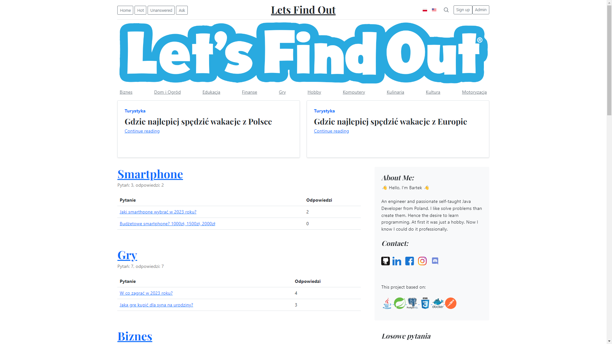
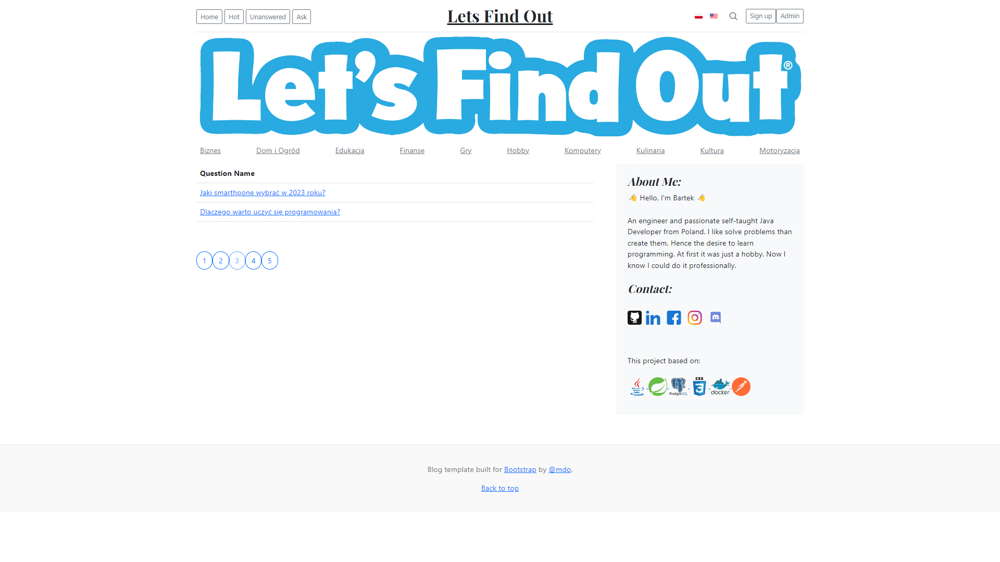
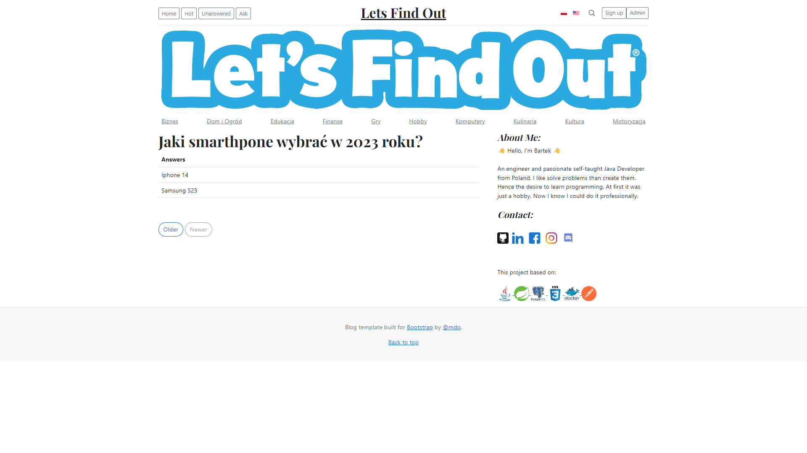
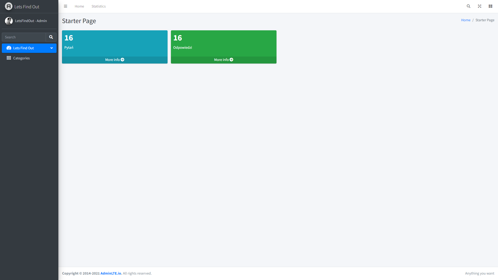
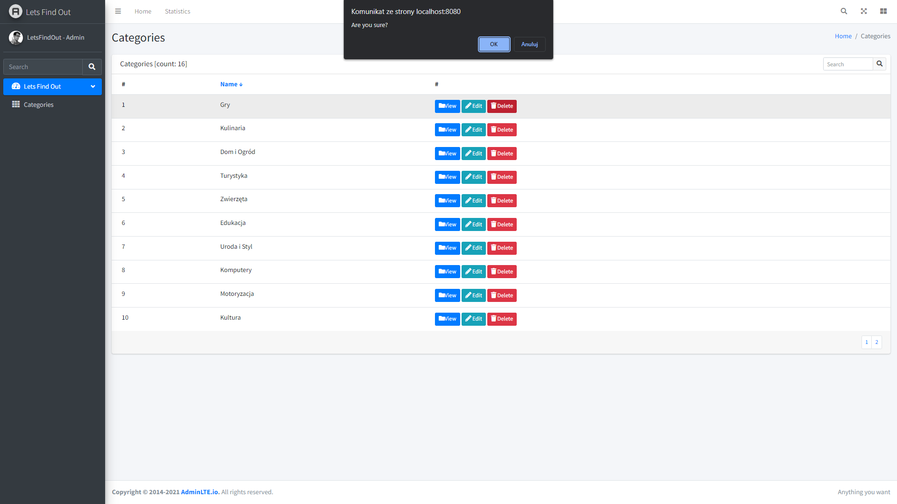
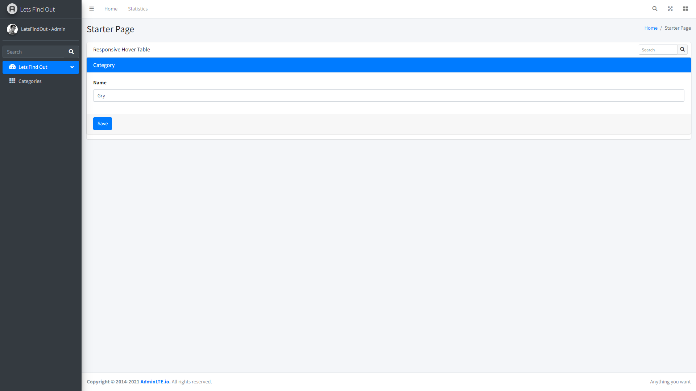

# LetsFindOut

#### Do you want to know the answer about something? Great! You are in good place! LetsFindOut is application where You can find the answer on any question you want and any topic you like. Maybe you know the answer on question which was asked for someone else? Share it!

## Table of Contents
* [General Information](#general-information)
* [Technologies Used](#technologies-used)
* [Screenshots](#screenshots)
* [Prerequisites](#prerequisites)
* [Setup](#setup)
* [Authors](#authors)

## General Information

LetsFindOut has been divided into two parts: Administrator and User.

As a user, you can not only browse and search for answers. You can also give answers. In addition, you can check which questions have the most answers or which have not been answered.

On the administrator's side, you can check the statistics of answers and questions asked. If you find that a question or category does not meet the requirements, you can: view, edit or delete.

The project is aimed at practical learning, implementing the knowledge gained in Tomasz Woliński's courses - JOP (Java from scratch) and EAI (Efficient Internet Applications).
The application is based on the REST architecture and the Minimum Viable Product (MVP) model.

## Technologies Used
### Development
- [Java 19](https://openjdk.org/projects/jdk/19/)
- [Spring Boot 2](https://spring.io/projects/spring-boot)
- [Spring Data](https://spring.io/projects/spring-data)
- [PostgreSQL (docker)](https://www.postgresql.org/)
- [Maven 3.x](https://maven.apache.org/)
- [Git](https://git-scm.com/)

### Test
- [JUnit5](https://junit.org/junit5/)
- [Mockito](https://site.mockito.org/)

## Screenshots

## Prerequisites
The following tools are required to start the application:

- [IntelliJ IDEA](https://www.jetbrains.com/idea/),
- [Java 19](https://openjdk.org/projects/jdk/19/),
- [Maven 3.x](https://maven.apache.org/download.cgi),
- [Docker](https://docs.docker.com/get-docker/)

## Setup

### To run this project 

**1.** Clone repository:

    git clone git@github.com:BartoszKarp/TinyUrl.git

**2.** After download project configurate your container in Docker and db server in few step:

- Create database connection with Docker pasting in command line:
  
      docker run --name postgrestinyurl -e POSTGRES_PASSWORD=password -d -p 5432:5432 postgres

- Connect with server:

      Login: postgres
      Password: password

## Authors
Created by StormIT community:
- bartek.karp93@gmail.com